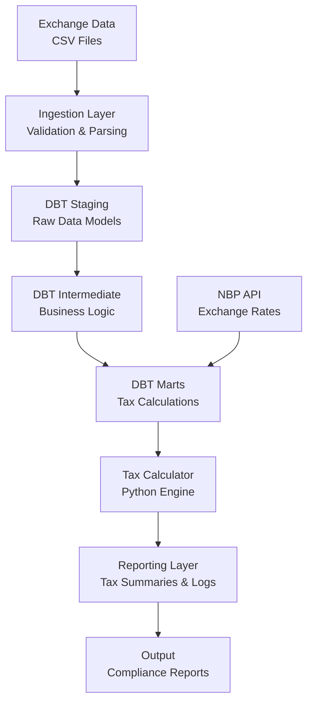

# Polish Cryptocurrency Tax Calculator

[](https://www.python.org/)
[](LICENSE)
[]()

A production-grade, automated tax calculation system for Polish cryptocurrency traders, implementing PIT-38 regulations with enterprise-level data processing, validation, and compliance reporting.

## Project Overview

This repository contains a comprehensive cryptocurrency tax calculator specifically designed for Polish tax regulations (PIT-38). The system automates the complex process of calculating capital gains taxes from crypto trading activities across multiple exchanges, ensuring compliance with Polish fiscal law while providing detailed reporting and validation capabilities.

The project demonstrates advanced data engineering practices, combining modern Python development with DBT for data transformations, resulting in a scalable, maintainable, and extensible solution suitable for both individual traders and financial institutions.

## Key Features

- **Automated Tax Calculations**: Implements Polish PIT-38 rules with global cost pooling (no FIFO requirement)
- **Multi-Exchange Support**: Native integration with Binance and Bybit, extensible to additional exchanges
- **Real-Time Rate Integration**: Automatic fetching of T-1 exchange rates from Poland's National Bank (NBP) API
- **Enterprise Data Pipeline**: DBT-powered transformations ensuring data quality and auditability
- **Comprehensive Validation**: Built-in data validation, error handling, and compliance checks
- **Performance Optimized**: Leverages Polars for high-performance data processing
- **Modular Architecture**: Clean separation of concerns enabling easy maintenance and extension
- **Detailed Reporting**: Generates tax summaries, transaction logs, and compliance documentation

## Tech Stack

- **Core Language**: Python 3.11+ with type hints and modern async patterns
- **Data Processing**: Polars for lightning-fast DataFrame operations, Pandas for compatibility
- **Data Transformation**: DBT (Data Build Tool) for SQL-based data modeling and testing
- **Dependency Management**: Poetry for reproducible environments
- **API Integration**: Requests with robust error handling for NBP rate fetching
- **Configuration**: PyYAML for flexible, environment-specific settings
- **Development Tools**: Ruff for linting, Black for formatting, MyPy for type checking
- **Testing**: Pytest with comprehensive test coverage
- **Documentation**: Jupyter Notebooks for interactive analysis and validation

## Architecture

The system follows a layered architecture separating data ingestion, transformation, calculation, and reporting:



**Data Flow**:
1. **Ingestion**: Raw CSV data from exchanges is validated and parsed
2. **Staging**: DBT models clean and standardize the data
3. **Transformation**: Business logic applies Polish tax rules
4. **Calculation**: Python engine computes gains/losses with NBP rates
5. **Reporting**: Generates detailed tax reports and validation summaries

## Example Use Cases

### Annual Tax Filing
```python
from src.tax.processor import CryptoTaxCalculator

calculator = CryptoTaxCalculator(config)
summary = calculator.calculate_tax_for_year(2024)
print(f"Total taxable gains: {summary.total_gains_pln} PLN")
```

### Multi-Exchange Portfolio Analysis
- Import trading data from Binance and Bybit simultaneously
- Generate consolidated tax reports across all exchanges
- Validate data integrity and identify potential compliance issues

### Compliance Validation
- Automated checks for data completeness and accuracy
- Detailed error reporting for manual review
- Audit trails for tax authority submissions

## Setup & Run Instructions

### Prerequisites
- Python 3.11 or higher
- Poetry (dependency management)
- Git

### Installation

1. **Clone the repository**:
   ```bash
   git clone https://github.com/yourusername/crypto-tax-calculator.git
   cd crypto-tax-calculator
   ```

2. **Install dependencies**:
   ```bash
   poetry install
   ```

3. **Activate the virtual environment**:
   ```bash
   poetry shell
   ```

### Configuration

1. **Update tax configuration**:
   Edit `config/tax_config.yml` with your tax year and exchange settings.

2. **Place exchange data**:
   Add your CSV files to `data/raw/` directory following the naming convention.

### Running the Calculator

1. **Run DBT transformations**:
   ```bash
   cd dbt
   dbt run
   dbt test
   ```

2. **Execute tax calculations**:
   ```bash
   python scripts/tax_report.py --year 2024
   ```

3. **Validate results**:
   Open `tax_validation.ipynb` in Jupyter for interactive analysis.

### Development

- **Run tests**: `pytest`
- **Lint code**: `ruff check .`
- **Format code**: `black .`
- **Type check**: `mypy src/`

## Highlights

### Design Decisions
- **DBT for Data Quality**: Chose DBT over custom Python ETL for its testing capabilities, documentation features, and SQL-based transformations that are more maintainable for complex business logic.
- **Polars over Pandas**: Selected Polars for its superior performance with large datasets and Rust-based implementation, critical for processing extensive trading histories.
- **Global Cost Pooling**: Implemented Polish tax law's global pooling requirement instead of FIFO, ensuring compliance while optimizing for performance.

### Performance Optimizations
- **Lazy Evaluation**: Leverages Polars' lazy evaluation for memory-efficient processing of large datasets.
- **Rate Caching**: Implements intelligent caching of NBP exchange rates to minimize API calls and improve response times.
- **Parallel Processing**: DBT's parallel execution capabilities maximize hardware utilization during data transformations.

### Modular Architecture
- **Separation of Concerns**: Clear boundaries between data ingestion, transformation, calculation, and reporting layers.
- **Plugin Architecture**: Exchange integrations are modular, allowing easy addition of new cryptocurrency platforms.
- **Configuration-Driven**: YAML-based configuration enables environment-specific deployments without code changes.

### Scalability Considerations
- **Horizontal Scaling**: DBT models can be distributed across multiple workers for large-scale processing.
- **Database Agnostic**: Current SQLite implementation can be upgraded to PostgreSQL or BigQuery for enterprise deployments.
- **API Rate Limiting**: Built-in rate limiting and retry logic for external API dependencies.
- **Incremental Processing**: Supports incremental data loading for continuous tax monitoring.

## Portfolio Section

This repository also includes a curated collection of data science and analytics projects in the `/portfolio/` directory, showcasing work from various online courses and certifications:

- **DataCamp Data Analyst with Python**: Comprehensive Python data analysis projects
- **DataCamp Data Analyst with SQL**: SQL-based data manipulation and visualization
- **IBM Data Science Professional Certification**: Advanced machine learning and data science projects
- **Personal & Work Projects**: Real-world applications and case studies

Each portfolio item demonstrates practical application of data science concepts and best practices.

## Contributing

Contributions are welcome! Please read the contributing guidelines and submit pull requests for new features or bug fixes.

## License

This project is licensed under the MIT License - see the LICENSE file for details.

## Contact

For questions or collaboration opportunities, please reach out via GitHub issues or email.

---

*Built with ❤️ for the Polish crypto community*

The sync workflow is defined in `.github/workflows/sync-gitlab.yml`.

## Contributing

[Add contribution guidelines]